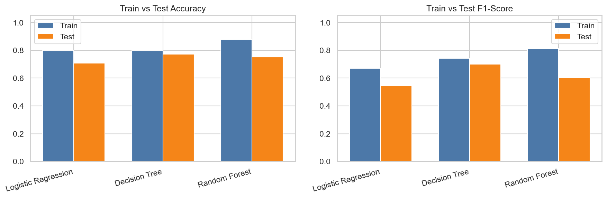
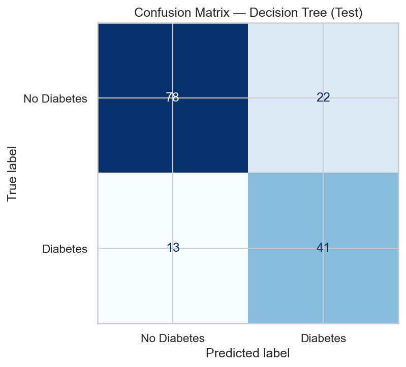
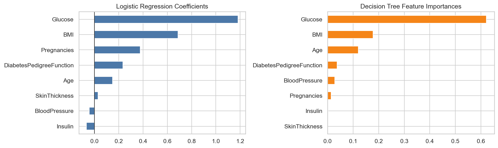

# Diabetes Prediction — Assignment Report

End-to-end Machine Learning classification pipeline on `diabetes.csv`.

## Part 1 — Data Preparation

- **Shape:** 768 rows × 9 columns
- **Columns:** Pregnancies, Glucose, BloodPressure, SkinThickness, Insulin, BMI, DiabetesPedigreeFunction, Age, Outcome
- **Dtypes:** all numeric (`int64` / `float64`)
- **Explicit NaNs:** none; zeros in Glucose/BloodPressure/SkinThickness/Insulin/BMI treated as missing
- **Target balance:** No Diabetes=500 (65.1%), Diabetes=268 (34.9%)
- **Features (X):** 8 medical attributes; **Target (y):** `Outcome` (0/1)
- **Preprocessing:** median imputation + StandardScaler (fit on train only)
- **Split:** stratified 80/20 → train=614, test=154

## Part 2 — Model Building

Implemented three classifiers:
1. **Logistic Regression** (`max_iter=1000`) — interpretable probabilistic baseline
2. **Decision Tree** (`max_depth=5`, `min_samples_leaf=10`) — non-linear rules with depth constraint
3. **Random Forest** (`n_estimators=200`, `max_depth=8`, `min_samples_leaf=5`) — ensemble for better generalization

## Part 3 — Model Training

| Model | Train Acc | Test Acc | Train F1 | Test F1 | Acc Gap |
|-------|-----------|----------|----------|---------|---------|
| Logistic Regression | 0.7964 | 0.7078 | 0.6702 | 0.5455 | 0.0886 |
| Decision Tree | 0.7980 | 0.7727 | 0.7438 | 0.7009 | 0.0253 |
| Random Forest | 0.8795 | 0.7532 | 0.8131 | 0.6042 | 0.1262 |

**Best model:** Decision Tree
**Overfitting/underfitting observation:** Train and test performance are reasonably close → no severe overfitting/underfitting.



## Part 4 — Model Evaluation (Best Model)

### Decision Tree — Test metrics

| Metric | Train | Test |
|--------|------:|-----:|
| Accuracy | 0.7980 | 0.7727 |
| Precision | 0.6667 | 0.6508 |
| Recall | 0.8411 | 0.7593 |
| F1-Score | 0.7438 | 0.7009 |

### Confusion Matrix (Test)

| | Pred No Diabetes | Pred Diabetes |
|--|--:|--:|
| **Actual No Diabetes** | TN = 78 | FP = 22 |
| **Actual Diabetes** | FN = 13 | TP = 41 |

- Sensitivity/Recall = 41/54 = **0.7593**
- Specificity = 78/100 = **0.7800**
- Precision = 41/63 = **0.6508**



```
              precision    recall  f1-score   support

 No Diabetes       0.86      0.78      0.82       100
    Diabetes       0.65      0.76      0.70        54

    accuracy                           0.77       154
   macro avg       0.75      0.77      0.76       154
weighted avg       0.78      0.77      0.78       154

```

## Part 5 — Performance Analysis

### Most important metric
**Recall (Sensitivity)** — missing a diabetic patient (False Negative) is clinically more costly than a false alarm.

### Is the model performing well?
**Yes, as an educational screening baseline.** Test Accuracy=0.7727, Recall=0.7593 (catches most positives), F1=0.7009, with a small train–test gap. Precision=0.6508 means some false alarms — acceptable for screening, not diagnosis. Not a clinical diagnostic tool.

### Key findings
- Best model by Test F1/Recall: **Decision Tree**
- Test Accuracy=0.7727, Precision=0.6508, Recall=0.7593, F1=0.7009
- Strongest LR signals: Glucose (1.183), BMI (0.689), Pregnancies (0.377)
- Top Decision Tree importances: Glucose (0.622), BMI (0.178), Age (0.120)



### Limitations
1. Small sample (~768 rows) and limited demographics
2. Heavy missingness (zeros) in Insulin / SkinThickness
3. Moderate class imbalance (~35% positive)
4. Single train/test split; not a clinical diagnostic tool

### Recommendations
1. Hyperparameter tuning (Grid/Random search) + Stratified K-Fold CV
2. Handle imbalance (`class_weight='balanced'`, SMOTE, threshold tuning) to raise Recall
3. Feature engineering (interactions, BMI/age bins) and try Gradient Boosting / XGBoost

---
*Generated by `src/train_and_evaluate.py`*