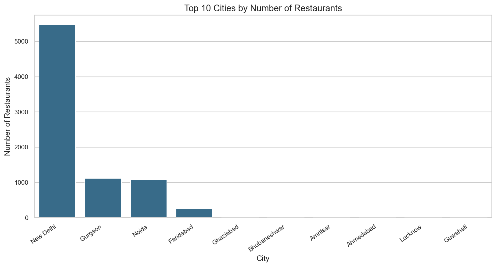
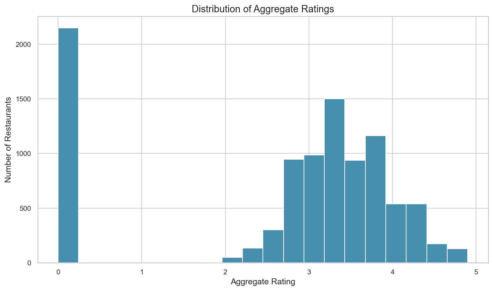
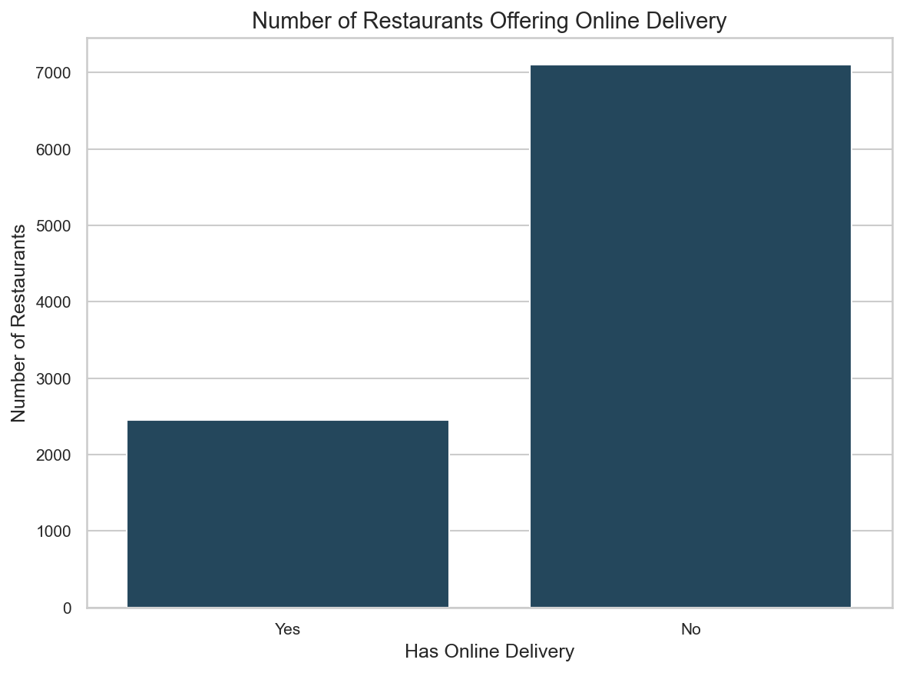
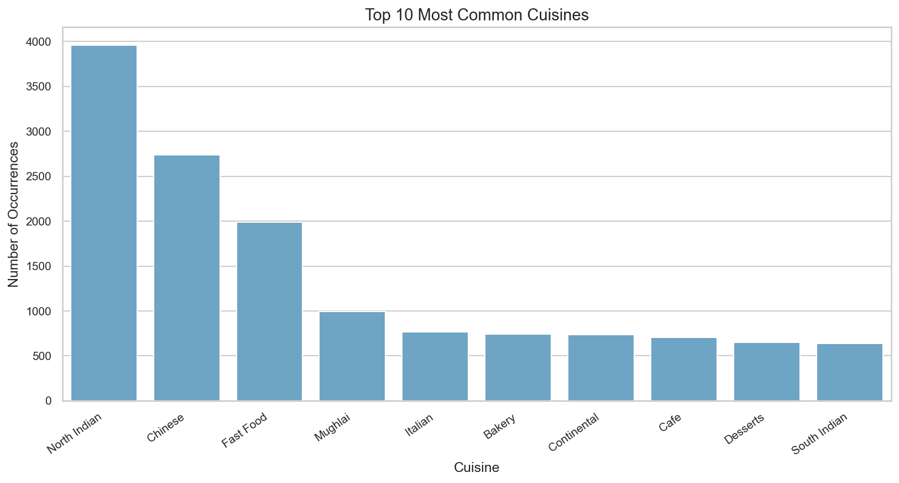
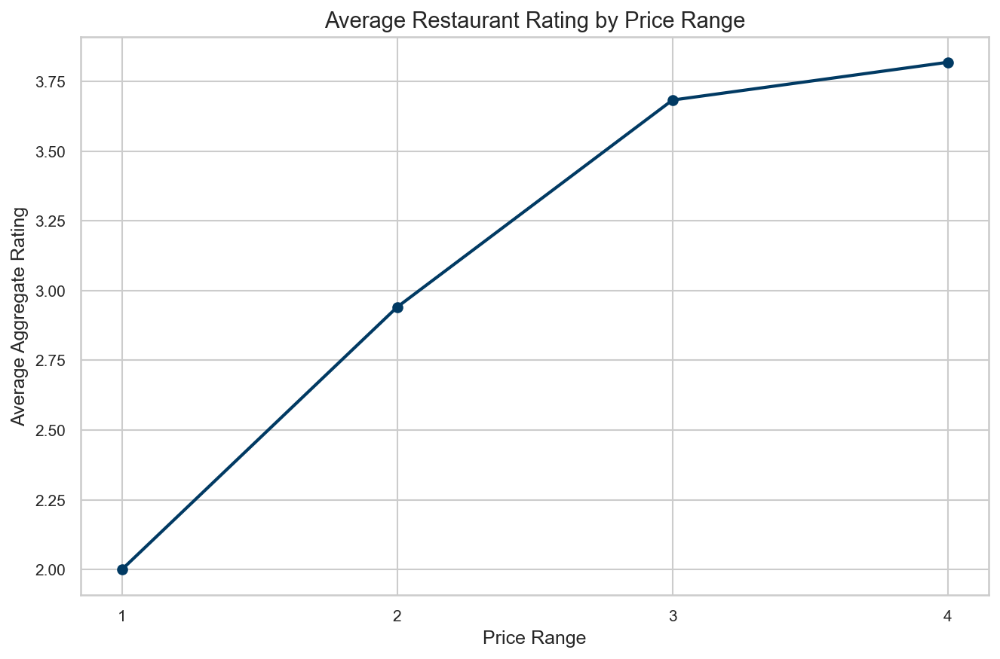

# Zomato Restaurant Dataset — EDA Report

## 1. Dataset Overview

This report summarizes exploratory data analysis on the Zomato restaurant dataset.
- **Rows (raw):** 9552
- **Columns (raw):** 22
- **Rows (cleaned):** 9550
- **Columns (cleaned):** 21

Key fields analyzed include City, Cuisines, Average Cost for two, Online Delivery,
Table Booking, Price Range, Aggregate Rating, and Votes.

## 2. Data Cleaning

- **Duplicate rows in raw data:** 0
- **Average Cost for two dtype (raw → clean):** `object` → `float64`
- **Values converted to NaN during Average Cost conversion:** 1
- **Corrupted rows dropped:** 2 (address-line break shifted columns for Super Loco / Robertson Quay).
- Missing Cuisines (9 remaining after cleaning) were retained for non-cuisine analyses.
- Remaining missing values are sparse (<0.2% for most columns) and were not force-dropped.

## 3. Data Analysis

### Required questions
1. **Unique cities:** 141
2. **City with most restaurants:** New Delhi (5,473 restaurants)
3. **Most frequent cuisine (after splitting multi-cuisine fields):** North Indian (3,960 occurrences)

### Additional analysis
- **Average aggregate rating:** 2.6663
- **Highest-voted restaurant:** Toit (Bangalore) with 10,934 votes
- **Average cost for two:** 1199.33 (mixed currencies; interpret carefully)
- **Online delivery ratings:** Yes = 3.2488, No = 2.4652, difference = 0.7836
- **Table booking ratings:** Yes = 3.4420, No = 2.5593, difference = 0.8827

### Statistical summary (key numerical columns)

| Metric | Average Cost for two | Price range | Aggregate rating | Votes |
|---|---:|---:|---:|---:|
| count | 9550 | 9550 | 9550 | 9550 |
| mean | 1199.3264 | 1.8046 | 2.6663 | 156.9230 |
| median | 400.0000 | 2.0000 | 3.2000 | 31.0000 |
| std | 16122.0232 | 0.9054 | 1.5164 | 430.1897 |
| min | 0.0000 | 1.0000 | 0.0000 | 0.0000 |
| max | 800000.0000 | 4.0000 | 4.9000 | 10934.0000 |

## 4. Data Visualizations

### Top 10 cities

New Delhi has the largest restaurant presence in this dataset, followed by other NCR cities such as Gurgaon and Noida.

### Aggregate rating distribution

The rating distribution shows a large spike at 0 (Not rated) and a cluster of rated restaurants roughly between 3.0 and 4.5.

### Online delivery availability

Most restaurants in the dataset do not offer online delivery; the No category is substantially larger than Yes.

### Top 10 cuisines

North Indian is the most common cuisine tag after splitting multi-cuisine restaurant listings.

### Average rating by price range

Average ratings generally increase with higher price ranges in this dataset, suggesting a positive association between price tier and reported rating (correlation/observation only, not causation).

## 5. Conclusion

- Highest restaurant presence: **New Delhi**.
- Most popular cuisine tag: **North Indian**.
- Restaurants with online delivery have a higher average rating (3.2488) than those without (2.4652).
- Restaurants with table booking have a higher average rating (3.4420) than those without (2.5593).
- Additional observations: restaurant concentration is heavily skewed toward New Delhi/NCR; many restaurants are unrated (rating = 0); price range and average rating move upward together in this sample.

### Limitations
- Average Cost for two mixes multiple currencies, so global mean cost is not directly comparable across countries.
- Ratings of 0 often mean 'Not rated' rather than a true zero-quality score.
- Associations (e.g., delivery vs rating) should not be interpreted as causal.
